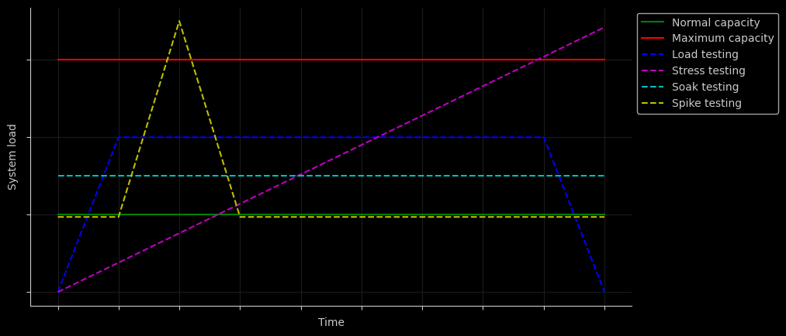
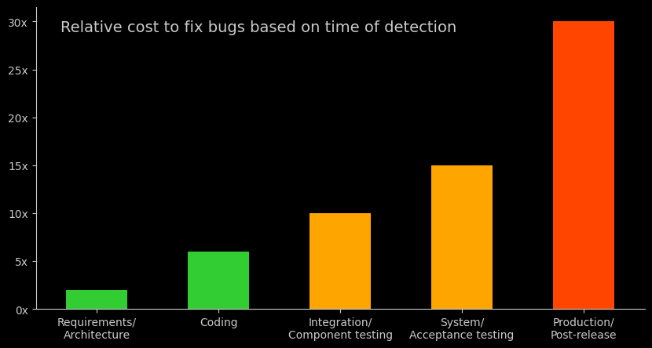
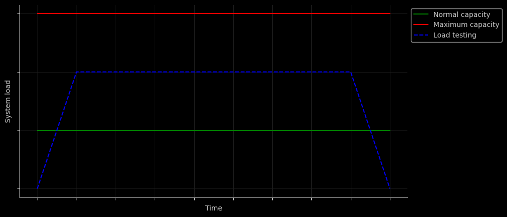
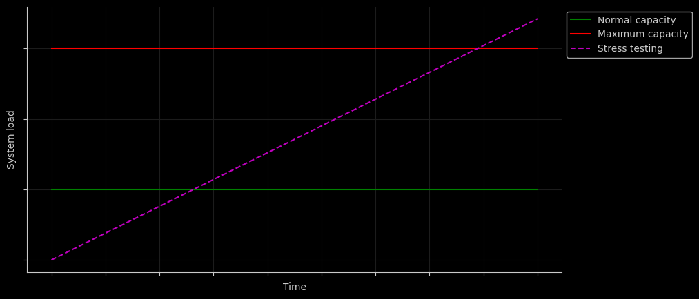
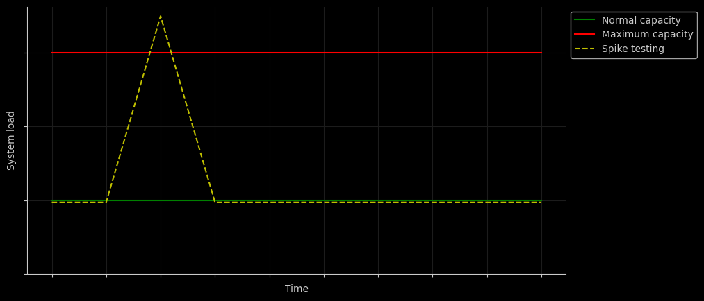

# Performance testing




## Table of contents

* [Performance testing](#performance-testing)
  * [What is Performance Testing?](#what-is-performance-testing)
  * [Importance of Performance Testing](#importance-of-performance-testing)
  * [Performance Testing Process](#performance-testing-process)
  * [Performance Testing Types](#performance-testing-types)
    * [Load Testing](#load-testing)
    * [Stress Testing](#stress-testing)
    * [Soak Testing (Endurance Testing)](#soak-testing-endurance-testing)
    * [Spike Testing](#spike-testing)
* [Example](#example)
  * [Scenario: User login with JWT authentication](#scenario-user-login-with-jwt-authentication)
    * [Case 1: Load testing](#case-1-load-testing)
    * [Case 2: Stress testing](#case-2-stress-testing)
    * [Case 3: Soak testing](#case-3-soak-testing)
    * [Case 4: Spike testing](#case-4-spike-testing)
  * [Implementations](#implementations)
* [Developers](#developers)

## Performance testing

### What is Performance Testing?

Performance testing is a crucial aspect of software testing that focuses on evaluating the speed, responsiveness, and
stability of a software application under various conditions. The primary goal is to ensure that the application meets
performance expectations, performs well under normal and peak loads, and remains stable over time.

Performance testing involves simulating real-world scenarios to assess the system's behavior and measure key
performance metrics such as response time, throughput, and resource utilization. This testing process helps identify
bottlenecks, uncover performance issues, and optimize the application for optimal user experience.

### Importance of Performance Testing

* **User Experience**: Performance testing ensures that users experience fast response times and smooth interactions with
  the application, contributing to a positive user experience.

* **Reliability**: By uncovering and addressing performance bottlenecks, performance testing enhances the reliability of
  the application, reducing the likelihood of crashes or downtime.

* **Scalability**: Performance testing helps determine the scalability of the application, ensuring it can handle
  increased loads as user numbers grow without compromising performance.

* **Cost Savings**: Identifying and addressing performance issues early in the development lifecycle can lead to cost
  savings by preventing the need for extensive rework and post-release fixes.



### Performance Testing Process

1. **Requirement Analysis**: Understand the performance requirements and objectives, including expected response times,
   concurrent user loads, and other relevant metrics.

2. **Test Planning**: Develop a comprehensive performance test plan outlining the testing strategy, test scenarios, test
   data, and performance metrics to be measured.

3. **Test Design**: Create performance test scenarios based on user workflows, defining the virtual user behavior, and
   selecting appropriate performance testing types.

4. **Test Execution**: Execute performance tests using selected tools, simulating real-world conditions to measure and
   analyze system performance.

5. **Monitoring and Analysis**: Monitor key performance metrics during test execution, analyze results, and identify
   performance bottlenecks or areas for improvement.

6. **Reporting**: Generate detailed performance test reports, including findings, recommendations, and performance
   metrics, for stakeholders and development teams.

### Performance Testing Types

#### Load Testing



Performance load testing involves evaluating a system's ability to handle a specific expected load or concurrent user
activity within normal operational parameters. It helps identify the maximum capacity of a system, ensuring that it
can handle the expected number of users, transactions, or data volumes without degrading performance.

#### Stress Testing



Performance stress testing is conducted to assess how well a system can handle extreme conditions or stress levels
beyond its normal capacity. The goal is to identify the breaking point of a system, uncover bottlenecks, and
understand how it behaves under extreme load to prevent performance failures under unexpected situations.

#### Soak Testing (Endurance Testing)


Performance soak testing involves running a system under a sustained load for an extended period to assess its
stability and performance over time. It helps identify memory leaks, resource utilization issues, and other gradual
performance degradations that may occur over an extended period, simulating real-world usage scenarios.

#### Spike Testing



Performance spike testing evaluates a system's ability to handle sudden and sharp increases in load or traffic. It
assesses how well a system can scale up to accommodate unexpected spikes in user activity, such as during promotional
events, product launches, or sudden increases in website traffic.

## Example

A simple controlled scenario is defined to run the different types of performance tests.

### Scenario: User login with JWT authentication

The system allows users to log in using JWT for authentication. Upon successful login, the system issues a JWT token
that must be included in subsequent requests to access protected resources.

**Test scenario**

* Simulate concurrent user login attempts.
* Each login attempt includes a valid username and password.
* Upon successful login, the system issues a JWT token.
* The token must be included in subsequent requests for accessing protected resources.

**System parameters**

* **Normal design capacity**: 2000 concurrent users.
* **Maximum design capacity**: 3000 concurrent users.

**Scenario thresholds**

* **HTTP errors**: HTTP errors should be less than 1%.
* **Response time**: 95% of requests should be below 500ms.

#### Case 1: Load testing

**Scenario parameters**

* **Maximum number of users**: 2400 concurrent users, 20% more than the normal design capacity.
* **Ramp-up period**: 1.5 minute, add 400 users every 15 seconds until reaching 2400 concurrent users.
* **Maximum number of users**: 2 minutes, keep the number of users constant at 2400
* **Ramp-down period**: 1.5 minutes, reduce 400 users every 30 seconds until reaching 0 concurrent users.
* **Test duration**: 5 minutes.

#### Case 2: Stress testing

**Scenario parameters**

* **maximum number of users**: 3600 concurrent users, 20% more than the maximum designed capacity.
* **initial number of users**: 2 minutes, start with 600 concurrent users and gradually increase.
* **ramp-up period**: 3 minutes, add 500 users every 30 seconds until reaching 3600 concurrent users.
* **test duration**: 5 minute

#### Case 3: Soak testing

**Scenario parameters**

* **number of users**: 2200 concurrent users, 10% more than the normal design capacity.
* **test duration**: 24 hours.

#### Case 4: Spike testing

**Scenario parameters**

* `test duration`: ~5 minutes.
* `number of spikes`: 2 spikes of 3600 concurrent users, 20% more than the maximum designed capacity.
* `initial number of users`: 1 minute 30 seconds, start with 2000 concurrent users.
* `first spike`: 1 second, add 1600 to reach 3600 concurrent users.
* `intermediate number of users`: 2 minutes, decrease to 2000 concurrent users.
* `second spike`: 1 second, add 1600 to reach 3600 concurrent users.
* `final number of users`: 1 minute 30 seconds, decrease to 2000 concurrent users.

### Implementations

* [Performance testing using k6 + Elasticsearch + Kibana + Docker compose](https://github.com/eccanto/base-performance-testing-k6-elasticsearch-kibana/tree/main)
* [Performance testing using Gatling with Java and Scala](https://github.com/eccanto/base-performance-testing-gatling)

## Developers

This project has resources that are generated programmatically using jupyter notebook, to edit them this tool is
required.

### Requirements

```bash
pip install -r requirements.txt
```

### Edit resources

```bash
jupyter lab --notebook-dir docs/images/jupyter/
```
