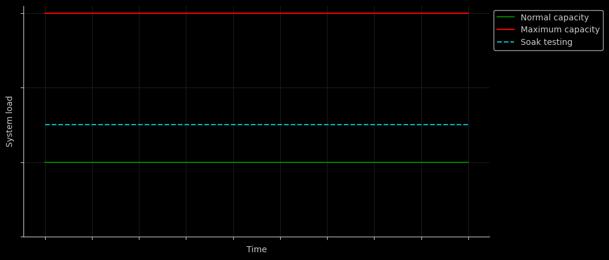

# Performance testing


## Table of contents

* [Performance testing](#performance-testing)
  * [What is Performance Testing?](#what-is-performance-testing)
  * [Importance of Performance Testing](#importance-of-performance-testing)
  * [Performance Testing Process](#performance-testing-process)
  * [Performance Testing Types](#performance-testing-types)
    * [Load Testing](#load-testing)
    * [Stress Testing](#stress-testing)
    * [Soak Testing (Endurance Testing)](#soak-testing-endurance-testing)
    * [Spike Testing](#spike-testing)
* [Examples](#examples)
* [Developers](#developers)

## Performance testing

### What is Performance Testing?

Performance testing is a crucial aspect of software testing that focuses on evaluating the speed, responsiveness, and
stability of a software application under various conditions. The primary goal is to ensure that the application meets
performance expectations, performs well under normal and peak loads, and remains stable over time.

Performance testing involves simulating real-world scenarios to assess the system's behavior and measure key
performance metrics such as response time, throughput, and resource utilization. This testing process helps identify
bottlenecks, uncover performance issues, and optimize the application for optimal user experience.

### Importance of Performance Testing

* **User Experience**: Performance testing ensures that users experience fast response times and smooth interactions with
  the application, contributing to a positive user experience.

* **Reliability**: By uncovering and addressing performance bottlenecks, performance testing enhances the reliability of
  the application, reducing the likelihood of crashes or downtime.

* **Scalability**: Performance testing helps determine the scalability of the application, ensuring it can handle
  increased loads as user numbers grow without compromising performance.

* **Cost Savings**: Identifying and addressing performance issues early in the development lifecycle can lead to cost
  savings by preventing the need for extensive rework and post-release fixes.


### Performance Testing Process

1. **Requirement Analysis**: Understand the performance requirements and objectives, including expected response times,
   concurrent user loads, and other relevant metrics.

2. **Test Planning**: Develop a comprehensive performance test plan outlining the testing strategy, test scenarios, test
   data, and performance metrics to be measured.

3. **Test Design**: Create performance test scenarios based on user workflows, defining the virtual user behavior, and
   selecting appropriate performance testing types.

4. **Test Execution**: Execute performance tests using selected tools, simulating real-world conditions to measure and
   analyze system performance.

5. **Monitoring and Analysis**: Monitor key performance metrics during test execution, analyze results, and identify
   performance bottlenecks or areas for improvement.

6. **Reporting**: Generate detailed performance test reports, including findings, recommendations, and performance
   metrics, for stakeholders and development teams.

### Performance Testing Types

#### Load Testing


Performance load testing involves evaluating a system's ability to handle a specific expected load or concurrent user
activity within normal operational parameters. It helps identify the maximum capacity of a system, ensuring that it
can handle the expected number of users, transactions, or data volumes without degrading performance.

#### Stress Testing


Performance stress testing is conducted to assess how well a system can handle extreme conditions or stress levels
beyond its normal capacity. The goal is to identify the breaking point of a system, uncover bottlenecks, and
understand how it behaves under extreme load to prevent performance failures under unexpected situations.

#### Soak Testing (Endurance Testing)



Performance soak testing involves running a system under a sustained load for an extended period to assess its
stability and performance over time. It helps identify memory leaks, resource utilization issues, and other gradual
performance degradations that may occur over an extended period, simulating real-world usage scenarios.

#### Spike Testing


Performance spike testing evaluates a system's ability to handle sudden and sharp increases in load or traffic. It
assesses how well a system can scale up to accommodate unexpected spikes in user activity, such as during promotional
events, product launches, or sudden increases in website traffic.

## Examples

* [Performance testing using k6 + Elasticsearch + Kibana + Docker compose](https://github.com/eccanto/base-performance-testing-k6-elasticsearch-kibana/tree/main)

## Developers

This project has resources that are generated programmatically using jupyter notebook, to edit them this tool is
required.

### Requirements

```bash
pip install -r requirements.txt
```

### Edit resources

```bash
jupyter lab --notebook-dir docs/images/jupyter/
```
